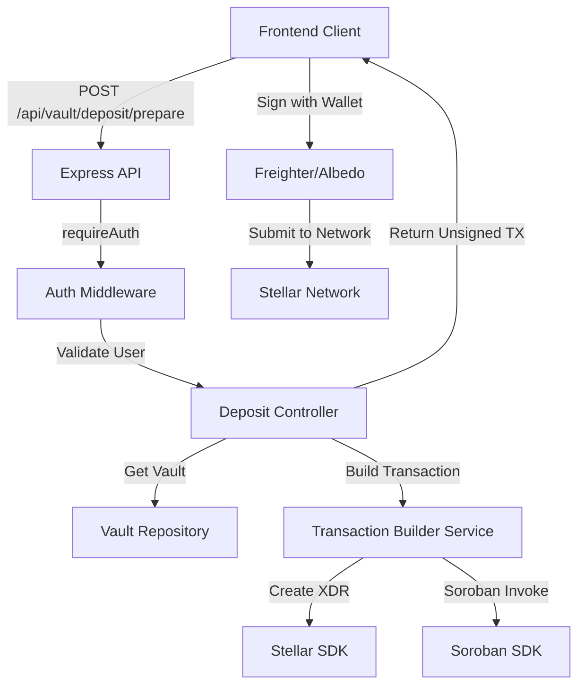

# Design Document: Deposit Transaction Builder

## Overview

The deposit transaction builder feature enables users to prepare unsigned Stellar/Soroban transactions for depositing USDC into their vault contracts. The backend builds transaction XDR or Soroban invoke arguments without ever handling user private keys, maintaining a non-custodial architecture. Users receive the unsigned transaction data, sign it with their wallet (Freighter/Albedo), and submit it to the Stellar network independently.

This design implements a secure, stateless transaction preparation endpoint that integrates with the existing vault system while adhering to the principle that the backend never signs transactions or holds user keys.

## Architecture



## Main Algorithm/Workflow

```mermaid
sequenceDiagram
    participant Client
    participant API
    participant Auth
    participant Controller
    participant VaultRepo
    participant TxBuilder
    participant StellarSDK
    
    Client->>API: POST /api/vault/deposit/prepare<br/>{amount_usdc: "100.0000000"}
    API->>Auth: requireAuth middleware
    Auth->>Auth: Extract x-user-id header
    Auth-->>API: Authenticated user context
    API->>Controller: prepareDeposit(userId, amount, network)
    Controller->>Controller: Validate amount format
    Controller->>VaultRepo: findByUserId(userId, network)
    VaultRepo-->>Controller: Vault {contractId, network}
    Controller->>TxBuilder: buildDepositTransaction(userPublicKey, contractId, amount, network)
    TxBuilder->>StellarSDK: Create transaction operation
    StellarSDK-->>TxBuilder: Transaction XDR
    TxBuilder-->>Controller: {xdr, network, operation}
    Controller-->>Client: 200 OK {xdr, network, contractId, amount}
    Client->>Wallet: Request signature for XDR
    Wallet-->>Client: Signed transaction
    Client->>StellarNetwork: Submit signed transaction


## Components and Interfaces

### Component 1: Deposit Controller

**Purpose**: HTTP request handler for the deposit preparation endpoint. Validates input, coordinates vault lookup and transaction building, and returns unsigned transaction data.

**Interface**:
```typescript
interface DepositController {
  prepareDeposit(
    req: Request,
    res: Response<unknown, AuthenticatedLocals>
  ): Promise<void>;
}
```

**Responsibilities**:
- Validate request body (amount_usdc format and range)
- Extract authenticated user from middleware context
- Retrieve user's vault for the specified network
- Delegate transaction building to TransactionBuilderService
- Return unsigned transaction data with metadata
- Handle errors (vault not found, invalid amount, service errors)

### Component 2: Transaction Builder Service

**Purpose**: Constructs unsigned Stellar/Soroban transactions for USDC deposits. Encapsulates all Stellar SDK interactions and transaction formatting logic.

**Interface**:
```typescript
interface TransactionBuilderService {
  buildDepositTransaction(params: BuildDepositParams): Promise<UnsignedTransaction>;
}

interface BuildDepositParams {
  userPublicKey: string;        // Stellar public key (G...)
  vaultContractId: string;      // Soroban contract ID (C...)
  amountUsdc: string;           // Amount in USDC with 7 decimals
  network: StellarNetwork;      // 'testnet' | 'mainnet'
  sourceAccount?: string;       // Optional: defaults to userPublicKey
}

interface UnsignedTransaction {
  xdr: string;                  // Base64-encoded transaction XDR
  network: string;              // Network identifier
  operation: TransactionOperation;
}

interface TransactionOperation {
  type: 'invoke_contract';
  contractId: string;
  function: string;             // e.g., 'deposit'
  args: SorobanInvokeArgs[];
}

type SorobanInvokeArgs = {
  type: 'address' | 'i128' | 'string';
  value: string;
};
```

**Responsibilities**:
- Build Soroban contract invocation for deposit function
- Convert USDC amount (7 decimals) to smallest units (stroops)
- Create transaction with proper network passphrase
- Set appropriate transaction fees and timeouts
- Return XDR without signing
- Validate contract ID format
- Handle Stellar SDK errors

### Component 3: Amount Validator

**Purpose**: Validates USDC amount format and range constraints.

**Interface**:
```typescript
interface AmountValidator {
  validateUsdcAmount(amount: string): ValidationResult;
}

interface ValidationResult {
  valid: boolean;
  error?: string;
  normalizedAmount?: string;    // Standardized to 7 decimals
}
```

**Responsibilities**:
- Verify amount is a valid decimal string
- Ensure exactly 7 decimal places (USDC standard)
- Check amount is positive and non-zero
- Validate amount doesn't exceed maximum (e.g., 1 billion USDC)
- Return normalized amount string

## Data Models

### Model 1: DepositPrepareRequest

```typescript
interface DepositPrepareRequest {
  amount_usdc: string;          // Required: "100.0000000" (7 decimals)
  network?: string;             // Optional: defaults to 'testnet'
  source_account?: string;      // Optional: custom source account
}
```

**Validation Rules**:
- `amount_usdc` must be a string matching pattern: `^\d+\.\d{7}$`
- `amount_usdc` must be > 0 and <= 1000000000.0000000
- `network` must be 'testnet' or 'mainnet' if provided
- `source_account` must be valid Stellar public key (G...) if provided

### Model 2: DepositPrepareResponse

```typescript
interface DepositPrepareResponse {
  xdr: string;                  // Base64-encoded unsigned transaction
  network: string;              // 'testnet' | 'mainnet'
  contractId: string;           // Vault contract ID
  amount: string;               // Echoed amount for verification
  operation: {
    type: 'invoke_contract';
    function: 'deposit';
    args: Array<{
      type: string;
      value: string;
    }>;
  };
  metadata: {
    fee: string;                // Transaction fee in stroops
    timeout: number;            // Transaction timeout in seconds
  };
}
```

### Model 3: Extended Vault Model

```typescript
interface Vault {
  id: string;
  userId: string;
  contractId: string;           // Soroban contract ID
  network: string;              // 'testnet' | 'mainnet'
  balanceSnapshot: bigint;      // Last known balance in smallest units
  lastSyncedAt: Date | null;
  createdAt: Date;
  updatedAt: Date;
}
```

**Note**: This extends the existing Vault model from `vaultRepository.ts`. No schema changes required.

## Key Functions with Formal Specifications

### Function 1: prepareDeposit()

```typescript
async function prepareDeposit(
  req: Request,
  res: Response<unknown, AuthenticatedLocals>
): Promise<void>
```

**Preconditions:**
- `res.locals.authenticatedUser` is defined (enforced by requireAuth middleware)
- `req.body.amount_usdc` is a string
- Request body is valid JSON

**Postconditions:**
- If successful: Returns 200 with `DepositPrepareResponse` containing valid XDR
- If vault not found: Returns 404 with error message
- If amount invalid: Returns 400 with validation error
- If service error: Returns 500 with error message
- No side effects on database (read-only operation)
- No private keys accessed or stored

**Loop Invariants:** N/A (no loops in main function)

### Function 2: buildDepositTransaction()

```typescript
async function buildDepositTransaction(
  params: BuildDepositParams
): Promise<UnsignedTransaction>
```

**Preconditions:**
- `params.userPublicKey` is valid Stellar public key format (G...)
- `params.vaultContractId` is valid Soroban contract ID format (C...)
- `params.amountUsdc` matches pattern `^\d+\.\d{7}$`
- `params.network` is 'testnet' or 'mainnet'
- Stellar SDK is properly initialized

**Postconditions:**
- Returns `UnsignedTransaction` with valid XDR string
- XDR represents unsigned transaction (no signatures)
- Transaction targets correct contract and network
- Amount is correctly converted to smallest units
- Transaction has appropriate fee and timeout
- Throws `InvalidContractIdError` if contract ID invalid
- Throws `NetworkError` if network configuration fails

**Loop Invariants:** N/A (no loops in main function)

### Function 3: validateUsdcAmount()

```typescript
function validateUsdcAmount(amount: string): ValidationResult
```

**Preconditions:**
- `amount` is a string (may be invalid format)

**Postconditions:**
- Returns `ValidationResult` with `valid: true` if amount passes all checks
- Returns `ValidationResult` with `valid: false` and `error` message if validation fails
- If valid: `normalizedAmount` is set to standardized 7-decimal format
- No mutations to input parameter
- Pure function (no side effects)

**Loop Invariants:** N/A (no loops)

## Algorithmic Pseudocode

### Main Processing Algorithm

```typescript
ALGORITHM prepareDepositTransaction(userId, requestBody, network)
INPUT: userId (string), requestBody (DepositPrepareRequest), network (string)
OUTPUT: response (DepositPrepareResponse) or error

BEGIN
  // Step 1: Validate amount format
  validation ← validateUsdcAmount(requestBody.amount_usdc)
  ASSERT validation.valid = true
  
  IF NOT validation.valid THEN
    THROW ValidationError(validation.error)
  END IF
  
  // Step 2: Retrieve user's vault
  vault ← vaultRepository.findByUserId(userId, network)
  
  IF vault = null THEN
    THROW VaultNotFoundError(userId, network)
  END IF
  
  ASSERT vault.contractId IS NOT EMPTY
  ASSERT vault.network = network
  
  // Step 3: Build unsigned transaction
  txParams ← {
    userPublicKey: derivePublicKeyFromUserId(userId),
    vaultContractId: vault.contractId,
    amountUsdc: validation.normalizedAmount,
    network: network,
    sourceAccount: requestBody.source_account
  }
  
  unsignedTx ← transactionBuilder.buildDepositTransaction(txParams)
  
  ASSERT unsignedTx.xdr IS NOT EMPTY
  ASSERT unsignedTx.network = network
  
  // Step 4: Construct response
  response ← {
    xdr: unsignedTx.xdr,
    network: unsignedTx.network,
    contractId: vault.contractId,
    amount: validation.normalizedAmount,
    operation: unsignedTx.operation,
    metadata: {
      fee: unsignedTx.fee,
      timeout: unsignedTx.timeout
    }
  }
  
  RETURN response
END
```

**Preconditions:**
- userId is authenticated and valid
- requestBody contains amount_usdc field
- network is 'testnet' or 'mainnet'
- Vault repository is initialized

**Postconditions:**
- Returns valid DepositPrepareResponse with unsigned XDR
- No database mutations
- No private key operations
- All validation errors are thrown with descriptive messages

**Loop Invariants:** N/A

### Transaction Building Algorithm

```typescript
ALGORITHM buildDepositTransaction(params)
INPUT: params (BuildDepositParams)
OUTPUT: unsignedTransaction (UnsignedTransaction)

BEGIN
  // Step 1: Initialize Stellar SDK with network
  IF params.network = 'testnet' THEN
    networkPassphrase ← Networks.TESTNET
    horizonUrl ← 'https://horizon-testnet.stellar.org'
  ELSE
    networkPassphrase ← Networks.PUBLIC
    horizonUrl ← 'https://horizon.stellar.org'
  END IF
  
  server ← new Server(horizonUrl)
  
  // Step 2: Load source account from network
  sourceKey ← params.sourceAccount OR params.userPublicKey
  sourceAccount ← AWAIT server.loadAccount(sourceKey)
  
  ASSERT sourceAccount IS NOT NULL
  
  // Step 3: Convert USDC amount to smallest units (stroops)
  // USDC has 7 decimals, so multiply by 10^7
  amountStroops ← parseFloat(params.amountUsdc) * 10000000
  amountInt128 ← Math.floor(amountStroops)
  
  ASSERT amountInt128 > 0
  
  // Step 4: Build Soroban contract invocation
  contractAddress ← new Address(params.vaultContractId)
  userAddress ← new Address(params.userPublicKey)
  
  operation ← Operation.invokeContractFunction({
    contract: contractAddress,
    function: 'deposit',
    args: [
      nativeToScVal(userAddress, {type: 'address'}),
      nativeToScVal(amountInt128, {type: 'i128'})
    ]
  })
  
  // Step 5: Build transaction
  transaction ← new TransactionBuilder(sourceAccount, {
    fee: BASE_FEE,
    networkPassphrase: networkPassphrase
  })
    .addOperation(operation)
    .setTimeout(300)  // 5 minutes
    .build()
  
  ASSERT transaction.signatures.length = 0  // Verify unsigned
  
  // Step 6: Convert to XDR
  xdr ← transaction.toXDR()
  
  // Step 7: Construct response
  result ← {
    xdr: xdr,
    network: params.network,
    operation: {
      type: 'invoke_contract',
      contractId: params.vaultContractId,
      function: 'deposit',
      args: [
        {type: 'address', value: params.userPublicKey},
        {type: 'i128', value: String(amountInt128)}
      ]
    },
    fee: BASE_FEE,
    timeout: 300
  }
  
  RETURN result
END
```

**Preconditions:**
- params.userPublicKey is valid Stellar public key
- params.vaultContractId is valid contract address
- params.amountUsdc is positive decimal with 7 places
- params.network is valid network identifier
- Stellar network is accessible

**Postconditions:**
- Returns UnsignedTransaction with valid XDR
- Transaction has zero signatures
- Amount is correctly converted to stroops
- Contract invocation targets correct function
- Transaction is valid for specified network

**Loop Invariants:** N/A

### Amount Validation Algorithm

```typescript
ALGORITHM validateUsdcAmount(amount)
INPUT: amount (string)
OUTPUT: validationResult (ValidationResult)

BEGIN
  // Step 1: Check if string is provided
  IF typeof amount ≠ 'string' THEN
    RETURN {valid: false, error: 'Amount must be a string'}
  END IF
  
  // Step 2: Check format with regex
  pattern ← /^\d+\.\d{7}$/
  IF NOT pattern.test(amount) THEN
    RETURN {
      valid: false,
      error: 'Amount must have exactly 7 decimal places (e.g., "100.0000000")'
    }
  END IF
  
  // Step 3: Parse to number
  numericAmount ← parseFloat(amount)
  
  IF isNaN(numericAmount) THEN
    RETURN {valid: false, error: 'Amount is not a valid number'}
  END IF
  
  // Step 4: Check positive and non-zero
  IF numericAmount ≤ 0 THEN
    RETURN {valid: false, error: 'Amount must be greater than zero'}
  END IF
  
  // Step 5: Check maximum limit (1 billion USDC)
  MAX_AMOUNT ← 1000000000.0000000
  IF numericAmount > MAX_AMOUNT THEN
    RETURN {
      valid: false,
      error: 'Amount exceeds maximum limit of 1,000,000,000 USDC'
    }
  END IF
  
  // Step 6: Normalize format
  normalizedAmount ← numericAmount.toFixed(7)
  
  // All validations passed
  RETURN {
    valid: true,
    normalizedAmount: normalizedAmount
  }
END
```

**Preconditions:**
- amount parameter is provided (may be any type)

**Postconditions:**
- Returns ValidationResult indicating success or failure
- If valid: normalizedAmount is properly formatted string
- If invalid: error message describes the specific validation failure
- No side effects on input

**Loop Invariants:** N/A

## Example Usage

```typescript
// Example 1: Successful deposit preparation
const request = {
  body: {
    amount_usdc: "100.0000000",
    network: "testnet"
  }
};

const response = await prepareDeposit(request, authenticatedResponse);

// Response:
{
  xdr: "AAAAAgAAAABx...(base64 XDR)...==",
  network: "testnet",
  contractId: "CDLZFC3SYJYDZT7K67VZ75HPJVIEUVNIXF47ZG2FB2RMQQVU2HHGCYSC",
  amount: "100.0000000",
  operation: {
    type: "invoke_contract",
    function: "deposit",
    args: [
      { type: "address", value: "GABC..." },
      { type: "i128", value: "1000000000" }
    ]
  },
  metadata: {
    fee: "100",
    timeout: 300
  }
}

// Example 2: Frontend wallet integration
async function depositToVault(amountUsdc: string) {
  // Step 1: Request unsigned transaction from backend
  const prepareResponse = await fetch('/api/vault/deposit/prepare', {
    method: 'POST',
    headers: {
      'Content-Type': 'application/json',
      'x-user-id': currentUserId
    },
    body: JSON.stringify({ amount_usdc: amountUsdc })
  });
  
  const { xdr, network } = await prepareResponse.json();
  
  // Step 2: Sign with user's wallet (Freighter example)
  const signedXdr = await window.freighterApi.signTransaction(xdr, {
    network: network,
    accountToSign: userPublicKey
  });
  
  // Step 3: Submit to Stellar network
  const server = new Server(
    network === 'testnet' 
      ? 'https://horizon-testnet.stellar.org'
      : 'https://horizon.stellar.org'
  );
  
  const transaction = TransactionBuilder.fromXDR(signedXdr, network);
  const result = await server.submitTransaction(transaction);
  
  return result.hash;
}

// Example 3: Error handling
try {
  const response = await prepareDeposit(request, authenticatedResponse);
} catch (error) {
  if (error instanceof VaultNotFoundError) {
    // User needs to create vault first
    return res.status(404).json({ 
      error: 'Vault not found. Please create a vault first.' 
    });
  } else if (error instanceof ValidationError) {
    // Invalid amount format
    return res.status(400).json({ 
      error: error.message 
    });
  } else {
    // Unexpected error
    return res.status(500).json({ 
      error: 'Failed to prepare deposit transaction' 
    });
  }
}

// Example 4: Amount validation
const validation1 = validateUsdcAmount("100.0000000");  // ✓ Valid
const validation2 = validateUsdcAmount("100.00");       // ✗ Wrong decimals
const validation3 = validateUsdcAmount("-50.0000000");  // ✗ Negative
const validation4 = validateUsdcAmount("0.0000000");    // ✗ Zero
```

## Correctness Properties

*A property is a characteristic or behavior that should hold true across all valid executions of a system—essentially, a formal statement about what the system should do. Properties serve as the bridge between human-readable specifications and machine-verifiable correctness guarantees.*

### Property 1: Unsigned Transaction Return

*For any* valid deposit request with authenticated user and valid amount, the Transaction_Builder should return an unsigned transaction XDR with zero signatures.

**Validates: Requirements 1.1, 3.1**

### Property 2: Vault Lookup Correctness

*For any* deposit request, the Transaction_Builder should retrieve the vault using the authenticated user's ID and the specified network.

**Validates: Requirements 1.2, 5.1**

### Property 3: Response Completeness

*For any* successful deposit preparation, the response should include the XDR, network identifier, vault contract ID, echoed amount, operation details, and transaction metadata (fee, timeout).

**Validates: Requirements 1.3, 1.4, 1.5**

### Property 4: Amount Format Validation

*For any* amount string, the Transaction_Builder should accept it only if it has exactly 7 decimal places and reject all other formats with a validation error.

**Validates: Requirements 2.1, 2.4**

### Property 5: Amount Normalization

*For any* valid amount, the Transaction_Builder should normalize it to exactly 7 decimal places in the response.

**Validates: Requirements 2.5**

### Property 6: Network Configuration Correctness

*For any* valid network value ('testnet' or 'mainnet'), the Transaction_Builder should use the corresponding Stellar network passphrase and include the network identifier in the response.

**Validates: Requirements 4.1, 4.2, 4.5**

### Property 7: Invalid Network Rejection

*For any* network value that is not 'testnet' or 'mainnet', the Transaction_Builder should reject the request with a validation error.

**Validates: Requirements 4.4**

### Property 8: Vault Contract ID Usage

*For any* successful deposit preparation, the contract ID in the transaction and response should match the vault's contract ID from the database.

**Validates: Requirements 5.3**

### Property 9: Authorization Enforcement

*For any* deposit request, the Transaction_Builder should only prepare transactions for vaults belonging to the authenticated user.

**Validates: Requirements 5.4, 9.4**

### Property 10: Contract Invocation Structure

*For any* built transaction, the operation should be a Soroban contract invocation targeting the 'deposit' function with the user's address as the first argument and the amount in stroops (i128) as the second argument, and operation details should be included in the response.

**Validates: Requirements 6.1, 6.2, 6.3, 6.4, 6.5**

### Property 11: Amount Conversion Correctness

*For any* valid USDC amount, the Transaction_Builder should convert it to stroops by multiplying by 10,000,000, flooring to an integer, and ensuring the result is greater than zero.

**Validates: Requirements 7.1, 7.2, 7.3**

### Property 12: Transaction Configuration

*For any* built transaction, the base fee should be set to 100 stroops and the timeout should be set to 300 seconds.

**Validates: Requirements 8.1, 8.2**

### Property 13: Source Account Loading

*For any* transaction build request, the Transaction_Builder should load the source account from the Stellar network using either the provided custom source account or the user's public key.

**Validates: Requirements 8.3, 8.4**

### Property 14: XDR Validity

*For any* generated XDR, it should be valid base64-encoded data that can be parsed back to a transaction object containing exactly one operation.

**Validates: Requirements 8.5, 15.1, 15.2, 15.3**

### Property 15: Authentication Requirement

*For any* request, the Transaction_Builder should require authentication and extract the user ID from the authentication context.

**Validates: Requirements 9.1, 9.3**

### Property 16: Validation Error Response

*For any* validation failure (amount, network, source account), the Transaction_Builder should return a 400 error with the specific validation issue before attempting to build the transaction.

**Validates: Requirements 10.2, 13.5**

### Property 17: Error Message Security

*For any* unexpected error, the Transaction_Builder should return a 500 error without revealing sensitive system details.

**Validates: Requirements 10.5**

### Property 18: Success Response Status

*For any* successful transaction preparation, the Transaction_Builder should return a 200 status code.

**Validates: Requirements 11.1**

### Property 19: Idempotency

*For any* set of build parameters, calling buildDepositTransaction multiple times with the same parameters should produce identical XDR output.

**Validates: Requirements 12.1**

### Property 20: Source Account Validation

*For any* provided custom source account, the Transaction_Builder should validate it is a valid Stellar public key format and reject invalid formats.

**Validates: Requirements 13.4**

### Property 21: Read-Only Database Operations

*For any* deposit preparation request, the Transaction_Builder should perform only read operations on the database without mutating vault data.

**Validates: Requirements 14.3**

## Error Handling

### Error Scenario 1: Vault Not Found

**Condition**: User requests deposit preparation but has no vault for the specified network
**Response**: HTTP 404 with error message
```typescript
{
  error: "Vault not found for user on network 'testnet'. Please create a vault first.",
  code: "VAULT_NOT_FOUND"
}
```
**Recovery**: User must create a vault before preparing deposits

### Error Scenario 2: Invalid Amount Format

**Condition**: Request contains amount_usdc with wrong decimal places or invalid format
**Response**: HTTP 400 with validation error
```typescript
{
  error: "Amount must have exactly 7 decimal places (e.g., '100.0000000')",
  code: "INVALID_AMOUNT_FORMAT",
  provided: "100.00"
}
```
**Recovery**: Client reformats amount to 7 decimals and retries

### Error Scenario 3: Amount Out of Range

**Condition**: Amount is zero, negative, or exceeds maximum limit
**Response**: HTTP 400 with range error
```typescript
{
  error: "Amount must be greater than zero and less than 1,000,000,000 USDC",
  code: "AMOUNT_OUT_OF_RANGE",
  provided: "0.0000000"
}
```
**Recovery**: Client validates amount before submission

### Error Scenario 4: Network Unavailable

**Condition**: Stellar Horizon server is unreachable or returns error
**Response**: HTTP 503 with service error
```typescript
{
  error: "Unable to connect to Stellar network. Please try again later.",
  code: "NETWORK_UNAVAILABLE",
  network: "testnet"
}
```
**Recovery**: Retry with exponential backoff; check Stellar network status

### Error Scenario 5: Invalid Contract ID

**Condition**: Vault contains malformed contract ID
**Response**: HTTP 500 with internal error
```typescript
{
  error: "Invalid vault contract configuration. Please contact support.",
  code: "INVALID_CONTRACT_ID"
}
```
**Recovery**: Admin must fix vault data; user contacts support

### Error Scenario 6: Unauthorized Access

**Condition**: Request missing x-user-id header or invalid authentication
**Response**: HTTP 401 with auth error
```typescript
{
  error: "Authentication required",
  code: "UNAUTHORIZED"
}
```
**Recovery**: Client must authenticate and include valid x-user-id header

## Testing Strategy

### Unit Testing Approach

Test each component in isolation with mocked dependencies:

1. **Amount Validator Tests**
   - Valid amounts with 7 decimals
   - Invalid formats (wrong decimals, non-numeric, missing decimal point)
   - Boundary values (zero, negative, maximum limit, maximum + 1)
   - Edge cases (very small amounts, scientific notation)

2. **Transaction Builder Tests**
   - Mock Stellar SDK to avoid network calls
   - Verify XDR generation with correct parameters
   - Test amount conversion to stroops
   - Validate contract invocation structure
   - Test both testnet and mainnet configurations
   - Verify transaction remains unsigned

3. **Deposit Controller Tests**
   - Mock vault repository and transaction builder
   - Test successful flow with valid inputs
   - Test error handling for each error scenario
   - Verify response structure matches interface
   - Test authentication middleware integration

**Coverage Goals**: 90%+ line coverage, 100% branch coverage for validation logic

### Property-Based Testing Approach

Use property-based testing to verify invariants across many generated inputs:

**Property Test Library**: fast-check (TypeScript)

**Property Test 1: Amount Validation Consistency**
```typescript
fc.assert(
  fc.property(
    fc.double({ min: 0.0000001, max: 1000000000, noNaN: true }),
    (amount) => {
      const formatted = amount.toFixed(7);
      const result = validateUsdcAmount(formatted);
      return result.valid === true && result.normalizedAmount === formatted;
    }
  )
);
```

**Property Test 2: XDR Roundtrip**
```typescript
fc.assert(
  fc.property(
    fc.string({ minLength: 56, maxLength: 56 }), // Stellar public key
    fc.string({ minLength: 56, maxLength: 56 }), // Contract ID
    fc.double({ min: 0.0000001, max: 1000000 }),
    async (userKey, contractId, amount) => {
      const tx = await buildDepositTransaction({
        userPublicKey: userKey,
        vaultContractId: contractId,
        amountUsdc: amount.toFixed(7),
        network: 'testnet'
      });
      
      // XDR should be parseable back to transaction
      const parsed = TransactionBuilder.fromXDR(tx.xdr, Networks.TESTNET);
      return parsed !== null && parsed.operations.length === 1;
    }
  )
);
```

**Property Test 3: Idempotency**
```typescript
fc.assert(
  fc.property(
    fc.record({
      userPublicKey: fc.stellarPublicKey(),
      vaultContractId: fc.contractId(),
      amountUsdc: fc.usdcAmount(),
      network: fc.constantFrom('testnet', 'mainnet')
    }),
    async (params) => {
      const tx1 = await buildDepositTransaction(params);
      const tx2 = await buildDepositTransaction(params);
      return tx1.xdr === tx2.xdr;
    }
  )
);
```

### Integration Testing Approach

Test the complete flow with real dependencies:

1. **End-to-End Deposit Preparation**
   - Set up test database with vault
   - Mock Stellar SDK network calls
   - Send HTTP request to endpoint
   - Verify response structure and XDR validity
   - Confirm no database mutations

2. **Wallet Integration Simulation**
   - Prepare transaction via API
   - Parse XDR with Stellar SDK
   - Simulate wallet signing
   - Verify signed transaction is valid for submission

3. **Error Flow Integration**
   - Test each error scenario end-to-end
   - Verify correct HTTP status codes
   - Confirm error response format

## Performance Considerations

1. **Transaction Building Latency**
   - Target: < 500ms for transaction preparation
   - Stellar SDK operations are synchronous and fast
   - Network call to load source account is the bottleneck
   - Consider caching account sequence numbers with TTL

2. **Concurrent Requests**
   - Stateless design supports horizontal scaling
   - No database writes, only reads (vault lookup)
   - Rate limiting recommended: 10 requests/minute per user

3. **XDR Size**
   - Typical XDR size: 500-1000 bytes (base64 encoded)
   - Minimal payload, suitable for mobile networks
   - No compression needed

4. **Memory Usage**
   - Stellar SDK transaction objects are lightweight
   - No long-lived state or caching required
   - Suitable for serverless deployment

## Security Considerations

1. **Non-Custodial Architecture**
   - Backend NEVER accesses or stores private keys
   - All transactions returned unsigned
   - User maintains full control of funds
   - Audit: Verify no signing operations in codebase

2. **Amount Validation**
   - Strict format validation prevents injection attacks
   - Maximum limit prevents overflow attacks
   - Decimal precision prevents rounding exploits

3. **Authentication**
   - Requires x-user-id header (enforced by requireAuth middleware)
   - Each user can only prepare transactions for their own vault
   - No cross-user vault access possible

4. **Input Sanitization**
   - All inputs validated before processing
   - Stellar SDK handles address format validation
   - No SQL injection risk (read-only repository calls)

5. **Network Security**
   - Use HTTPS for all API communication
   - XDR transmitted over encrypted channel
   - Validate network parameter to prevent wrong-network attacks

6. **Rate Limiting**
   - Implement per-user rate limits to prevent abuse
   - Prevent DoS attacks on Stellar network
   - Recommended: 10 requests/minute per user

7. **Error Information Disclosure**
   - Error messages don't reveal sensitive system details
   - Generic errors for unexpected failures
   - Detailed errors only for client-side issues

## Dependencies

### External Libraries

1. **@stellar/stellar-sdk** (v11.x)
   - Purpose: Build Stellar transactions and XDR encoding
   - Used for: TransactionBuilder, Server, Networks, Operation
   - License: Apache 2.0

2. **@stellar/stellar-base** (included with stellar-sdk)
   - Purpose: Low-level Stellar primitives
   - Used for: Address, nativeToScVal, XDR parsing

### Internal Dependencies

1. **VaultRepository** (`src/repositories/vaultRepository.ts`)
   - Used for: Retrieving user vault by userId and network
   - Methods: `findByUserId(userId: string, network: string)`

2. **requireAuth Middleware** (`src/middleware/requireAuth.ts`)
   - Used for: Authenticating requests and extracting user ID
   - Provides: `res.locals.authenticatedUser`

3. **Error Handler** (`src/middleware/errorHandler.ts`)
   - Used for: Consistent error response formatting
   - Handles: All thrown errors from controllers

### External Services

1. **Stellar Horizon API**
   - Testnet: `https://horizon-testnet.stellar.org`
   - Mainnet: `https://horizon.stellar.org`
   - Purpose: Load source account for transaction building
   - Fallback: Cache account data to reduce dependency

2. **Soroban RPC** (future consideration)
   - May be needed for contract simulation
   - Not required for basic transaction building

### Environment Configuration

Required environment variables:
```bash
STELLAR_NETWORK=testnet              # or 'mainnet'
STELLAR_HORIZON_URL=https://...      # Optional: override default
STELLAR_BASE_FEE=100                 # Optional: default 100 stroops
TRANSACTION_TIMEOUT=300              # Optional: default 5 minutes
```
